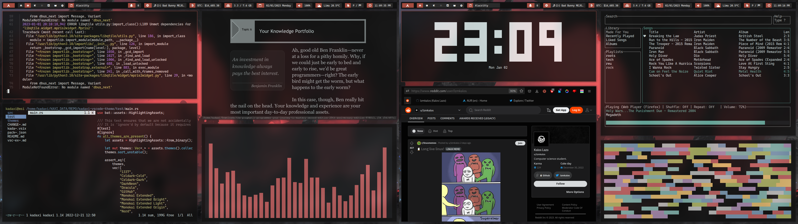

# 🐧 Linux dotfiles

## 🔧 Tech stack
- 🧬 **Distro**: Arch linux
- 🐍 **WM**: Qtile
- 🌠 **Shell**: Zsh
- 🖌️ **Terminal**: Alacritty
- 🚀 **Launcher**: Rofi
- 📚 **PDF Viewer**: Zathura
- 🔭 **Fetch Information**: Macchina
- 🧑‍🚀 **Prompt**: Starship
- 🌐 **Browser**: Firefox, erebus theme

> Check out `must-install.md` for get a list of packages/tools to install and setup dotfiles succesfully!

## 🔎 Inspiration
- [Erebus theme](https://github.com/kadaxi)
- [CozyTile](https://github.com/Darkkal44/CozyTile)